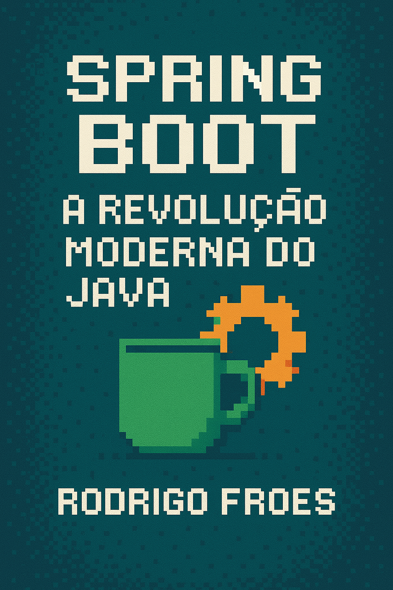

---

# 📘 Spring Boot: A Revolução Moderna do Java

Este projeto consiste na criação de um mini eBook com título, conteúdo, capa e apresentação visual, utilizando ferramentas de inteligência artificial e design para fins educacionais e de estudo.

## 🛠️ Ferramentas Utilizadas

- ChatGPT (OpenAI)
- Microsoft PowerPoint

---

## 💡 Prompts Utilizados

| Ação         | Prompt                                                                 |
|--------------|------------------------------------------------------------------------|
| **Título**   | "Gostaria de 5 títulos poderosíssimos para um ebook que conta brevemente a historia do java com springboot" |
| **eBook**    | "Seguindo esse título 'Spring Boot: A Revolução Moderna do Java' gostaria que gerasse um mini ebook seguindo esse título" |
| **Capa**     | "Seguindo esse título, gostaria de criar uma capa para esse ebook trazendo nessa capa algo que possa despertar o interesse no leitor" |

---

[📥 Baixar eBook em PDF](./ebook.pdf)

> Projeto gerado com fins educativos e demonstrativos de uso de IA para criação de conteúdo técnico.
